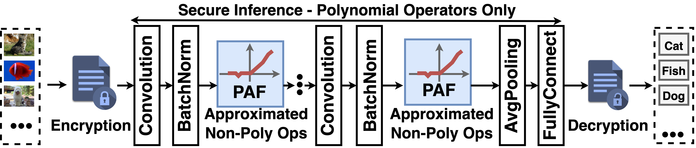
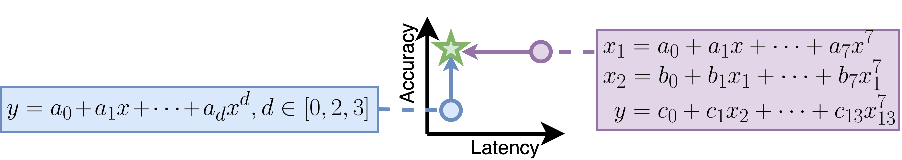

# SmartPAF: Accurate Low-Degree Polynomial Approximation of Non-polynomial Operators for Fast Private Inference in Homomorphic Encryption

## Motivation
Secure Fully Homomorphic Encryption (FHE) based Machine Learning Inference Converts Non-polynomial Operators (ReLU/MaxPooling) into Polynomial Approximation Functions (PAF)


Existing PAFs suffer from either prohibitive latency overhead or low accuracy. PAF-FHE proposes four training techniques to enable exploration on the entire PAF degree space and spot high-accuracy low-latency PAF.


## Results
PAF-FHE spots optimal 14-degree PAF with 69.4% accuracy (the same accuracy as plaintext pretrained ResNet-18 under ImageNet-1k dataset) and saves 72% latency of 27-degree Minimax PAF.

| Model-Dataset                             | Technique Setup                                                      | $f_1^2 \circ g_1^2$             | \alpha=7                        | $f_2\circ g_3$                  | $f_2\circ g_2$                  | $f_1\circ g_2$                  |
|-------------------------------------------|----------------------------------------------------------------------|---------------------------------|---------------------------------|---------------------------------|---------------------------------|---------------------------------|
|           Replace ReLU  |
|                                           | baseline + CT + DS w/o fine tune                                     | 68.60\%                         | 67.70\%                         | 67.00\%                         | 66.50\%                         | 61.70\%                         |
|                                           | baseline + DS                                                        | 64.30\%                         | 66.70\%                         | 64.20\%                         | 58.30\%                         | 53.10\%                         |
|                                           | baseline + AT + DS                                                   | 65.20\%                         | 68.30\%                         | 63.70\%                         | 60.50\%                         | 52.00\%                         |
|                                           | 63.40\%                                                              | 68.10\%                         | 63.30\%                         | 57.60\%                         | 49.50\%                         |
|        ResNet-18 (ImageNet-1k)              | baseline + PA + DS                                                   | 65.60\%                         | {68.40\%}                | 64.60\%                         | 60.20\%                         | 52.60\%                         |
|                 69.4%                     | baseline + PA + AT + DS                                              | 64.90\%                         | 67.40\%                         | 64.60\%                         | 56.50\%                         | 47.10\%                         |
|                                           | baseline + CT + PA + DS                                              | 68.20\%                         | 67.00\%                         | {67.60\%}                | 65.90\%                         | 60.80\%                         |
|                                           | baseline + CT + PA + AT + DS                                         | {69.00\%}                | 68.10\%                         | 61.40\%                         | {66.50\%}                | {63.10\%}                |
|                                           | {Accuracy Improvement over Baseline}                     | 1.35$\times$                    | 1.06$\times$                    | 1.37$\times$                    | 2.08$\times$                    | 3.39$\times$                    |
|                                           | {Accuracy Improvement over ``baseline + DS"}             | +4.7\%(1.07$\times$)            | +1.7\%(1.03$\times$)            | +3.4\%(1.05$\times$)            | +8.2\%(1.14$\times$)            | +10\%(1.19$\times$)             |
|                                           | {Accuracy Improvement over baseline}                     | 1.07$\times$                    | 1.03$\times$                    | 1.05$\times$                    | 1.14$\times$                    | 1.19$\times$                    |
|-------------------------------------------|----------------------------------------------------------------------|---------------------------------|---------------------------------|---------------------------------|---------------------------------|---------------------------------|
| Replace all Non Polynomial Operators      |
|                                           | baseline + CT + DS w/o fine tune                                     | 64.4\%                          | 59.4\%                          | 40.9\%                          | 33.1\%                          | 13.3\%                          |
|                                           | baseline + DS                                                        | 59.6\%                          | 66.2\%                          | 62\%                            | 49\%                            | 37\%                            |
|        ResNet-18 (ImageNet-1k)            | baseline + SS ({prior work~\cite{Minimax_approximation}})     | 25.5\%                          | 47.1\%                          | 23\%                            | 4.2\%                           | 0\%                             |
|                 69.4%                          | baseline + CT + PA + AT + DS                                         | {69.9\%}                 | {68\%}                   | {65.7\%}                 | {64.1\%}                 | {57.8}\%                 |
|                                           | \smartfhe: baseline + CT + PA + AT + SS                              |69.4\%  |67\%    |65.3\%  |57.3\%  |6.5\%   |
|                                           | {Accuracy Improvement over Baseline}                     | 1.07$\times$                    | 1.22$\times$                    | 1.27$\times$                    | 1.79$\times$                    | 0.22$\times$                    |
|                                           | {Accuracy Improvement over~\cite{Minimax_approximation}} | +43.9\%(2.72$\times$)           | +19.9\%(1.42$\times$)           | +42.3\%(2.84$\times$)           | +53.1\%(13.64$\times$)          | +6.5\%(\infty)                  |
|-------------------------------------------|----------------------------------------------------------------------|---------------------------------|---------------------------------|---------------------------------|---------------------------------|---------------------------------|
| Replace all Non Polynomial Operators      |
|                                           | baseline + SS ({prior work~\cite{Minimax_approximation}})     | 91.06\%                         | 81.35\%                         | 76.58\%                         | 58.11\%                         | 43.84\%                         |
|                                           | baseline + CT + DS                                                   | 93.39\%                         | 93.6\%                          | 93.3\%                          | {92.4\%}                 | {91.53\%}                |
|         VGG-19 (CiFa-10)                  | baseline + CT + PA + AT + DS                                         | {93.6\%}                 | {93.81\%}                | {93.59\%}                | 91.49\%                         | 91.51\%                         |
|                93.95                      | \smartfhe: baseline + CT + PA + AT + SS                              |92.16\% |92.62\% |91.51\% |88.45\% |76.93\% |
|                                           | {Accuracy Improvement over Baseline}                     | 1.07$\times$                    | 1.22$\times$                    | 1.27$\times$                    | 1.79$\times$                    | 0.22$\times$                    |
|                                           | {Accuracy Improvement over~\cite{Minimax_approximation}} | +1.1\%(1.01$\times$)            | +11.27\%(1.14$\times$)          | +14.93\%(1.2$\times$)           | +30.34\%(1.52$\times$)          | +33.09\%(1.75$\times$)          |
|-------------------------------------------|----------------------------------------------------------------------|---------------------------------|---------------------------------|---------------------------------|---------------------------------|---------------------------------|


# Ready to run?
```
#Activate Conda
# Create a python3.8 enviroment
conda create --name PAF-FHE  python=3.8

# Activate the enviroment
conda activate PAF-FHE

# Install package
conda install pytorch torchvision torchaudio pytorch-cuda=11.7 -c pytorch -c nvidia
conda install -c conda-forge pytorch-lightning

# Download cifar10 pretrained models
cd PyTorch_CIFAR10/
sh download_weights.sh 
cd ..

# Open /global_config/global_config.yaml
#Edit "dataset_dirctory:" to set a folder to store dataset.

# Download dataset
python3 util.py -dd True --dataset cifar10
python3 util.py -dd True --dataset cifar100
python3 util.py -dd True --dataset imagenet_1k
```


## Control Parameters for the library
```
typical step
For one model with a dataset, one -wd (working directory) should be used
--model: 		resnet18, vgg19_bn, resnet32
--dataset: 	cifar10, imagenet, cifar100
-st: 			a7, 2f12g1, f2f2, f2g3, f1g2
Supported combination: vgg19_bn & imagenet, vgg19_bn & cifar10, resnet18 & imagenet, and resnet32 & cifar100
-st is the supported PAF type
-dc stands for "data collection": 
```

## ResNet-18 on ImageNet_1k
```
# The following steps must be run in serial, as following steps need results from previous steps.
# Collection CT data
python3 ./CT.py --model resnet18 --dataset imagenet_1k -wd ../resnet18_imagenet1k/ -dc True
# CT
python3 ./CT.py --model resnet18 --dataset imagenet_1k -wd ../resnet18_imagenet1k/ -st 2f12g1
# PA and AT
python3 ./PA_AT.py --model resnet18 --dataset imagenet_1k -wd ../resnet18_imagenet1k/ -st 2f12g1
# Statistic Scale.
python3 ./SS.py --model resnet18 --dataset imagenet_1k -wd ../resnet18_imagenet1k/ -st 2f12g1
```
## ResNet-32 on CiFar-100
```
# The following steps must be run in serial, as following steps need results from previous steps.
# Collection CT data
python3 ./CT.py --model resnet32 --dataset cifar100 -wd ../resnet32_cifar100/ -dc True
# CT
python3 ./CT.py --model resnet32 --dataset cifar100 -wd ../resnet32_cifar100/ -st 2f12g1
# PA and AT
python3 ./PA_AT.py --model resnet32 --dataset cifar100 -wd ../resnet32_cifar100/ -st 2f12g1
# Statistic Scale.
python3 ./SS.py --model resnet32 --dataset cifar100 -wd ../resnet32_cifar100/ -st 2f12g1
```

## VGG-19 on CiFar-10
```
# The following steps must be run in serial, as following steps need results from previous steps.
# Collection CT data
python3 ./CT.py --model vgg19_bn --dataset cifar10 -wd ../vgg19_bn_cifar10/ -dc True
# CT
python3 ./CT.py --model vgg19_bn --dataset cifar10 -wd ../vgg19_bn_cifar10/ -st 2f12g1
# PA and AT
python3 ./PA_AT.py --model vgg19_bn --dataset cifar10 -wd ../vgg19_bn_cifar10/ -st 2f12g1
# Statistic Scale.
python3 ./SS.py --model vgg19_bn --dataset cifar10 -wd ../vgg19_bn_cifar10/ -st 2f12g1
```

## VGG-19 on ImageNet_1k
```
# The following steps must be run in serial, as following steps need results from previous steps.
# Collection CT data
python3 ./CT.py --model vgg19_bn --dataset imagenet_1k -wd ../vgg19_bn_imagenet1k/ -dc True
# CT
python3 ./CT.py --model vgg19_bn --dataset imagenet_1k -wd ../vgg19_bn_imagenet1k/ -st 2f12g1
# PA and AT
python3 ./PA_AT.py --model vgg19_bn --dataset imagenet_1k -wd ../vgg19_bn_imagenet1k/ -st 2f12g1
# Statistic Scale.
python3 ./SS.py --model vgg19_bn --dataset imagenet_1k -wd ../vgg19_imagenet1k/ -st 2f12g1
```

# Maintainer
Jingtian Dang (dangjingtian@gatech.edu)

Jianming Tong (jianming.tong@gatech.edu)

Tushar Krishna (tushar@ece.gatech.edu)

# Technical Contributors
Jingtian Dang (dangjingtian@gatech.edu)

Jianming Tong (jianming.tong@gatech.edu)

Tushar Krishna (tushar@ece.gatech.edu)

# Citations
```
@misc{tong2024accurate,
      title={Accurate Low-Degree Polynomial Approximation of Non-polynomial Operators for Fast Private Inference in Homomorphic Encryption}, 
      author={Jianming Tong and Jingtian Dang and Anupam Golder and Callie Hao and Arijit Raychowdhury and Tushar Krishna},
      year={2024},
      eprint={2404.03216},
      archivePrefix={arXiv},
      primaryClass={cs.CR}
}
```